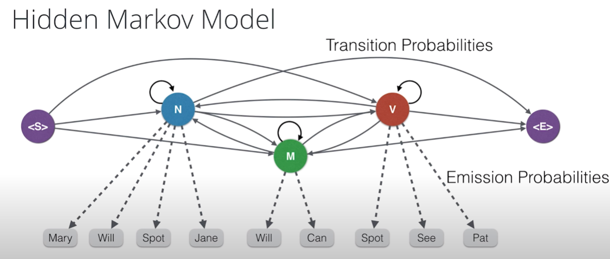

# **Project 1: Part of Speech Tagger**



Part of speech tagging is the process of determining the syntactic category of a word from the words in its surrounding context. It is often used to help disambiguate natural language phrases because it can be done quickly with high accuracy. Tagging can be used for many NLP tasks like determining correct pronunciation during speech synthesis (for example, _dis_-count as a noun vs dis-_count_ as a verb), retrieving information, and disambiguating word sense.

The Pomegranate library was used to build a hidden Markov model for part of speech tagging with a universal tagset. Hidden Markov models have been able to achieve >96% tag accuracy with larger tagsets on realistic text corpora. Hidden Markov models have also been used for speech recognition and speech generation, machine translation, gene recognition for bioinformatics, and human gesture recognition for computer vision, and more.


## **Tasks**


The tasks for this project are outlined in the HMM tagger.ipynb in three steps. Below are the steps taken.


**Step 1 - Review the text corpus**


*   Review the interface to load and access the text corpus


**Step 2 - Build a MFC tagger**


*   Build a Most Frequent Class tagger to use as a baseline
*   Count the frequency of each word in the corpus
*   Evaluate the accuracy of the MFC tagger


**Step 3 - Build an HMM tagger**


*   Build an HMM Part of Speech tagger and compare to the MFC baseline
*   Count unigrams, bigrams, starting, and ending tags to estimate their probabilities in input sequences
*   Estimate the frequency of tags & words from the frequency counts of observations in the training corpus.
*   Evaluate the accuracy of the HMM tagger


### Github repositories:

Below are the two github repositories used to complete the project. You can download a copy of the project materials, select the appropriate link for your program below, then follow the instructions in the readme to set up and complete the project.

*   [AIND GitHub](https://github.com/udacity/artificial-intelligence)(Projects/4_HMM Tagger)
*   [NLPND GitHub](https://github.com/udacity/hmm-tagger)

## **Below is the README file included in the course

## Introduction

In this notebook, you'll use the [Pomegranate](https://github.com/jmschrei/pomegranate) library to build a hidden Markov model for part of speech tagging with a [universal tagset](http://www.petrovi.de/data/universal.pdf). Hidden Markov models have been able to achieve >96% tag accuracy with larger tagsets on realistic text corpora. Hidden Markov models have also been used for speech recognition and speech generation, machine translation, gene recognition for bioinformatics, and human gesture recognition for computer vision, and more.

The notebook already contains some code to get you started. You only need to add some new functionality in the areas indicated to complete the project; you will not need to modify the included code beyond what is requested. Sections that begin with **'IMPLEMENTATION'** in the header indicate that you must provide code in the block that follows. Instructions will be provided for each section, and the specifics of the implementation are marked in the code block with a `'TODO'` statement. Please be sure to read the instructions carefully!

## Getting Started

You can choose one of two ways to complete the project. The first method is to use the Workspace embedded in the classroom in the next lesson. The Workspace has already been configured with all the required project files for you to complete the project. Simply open the lesson, complete the sections indicated in the Jupyter notebook, and then click the "submit project" button.

**NOTE:** If you are prompted to select a kernel when you launch a notebook, choose the **Python 3** kernel.

Alternatively, you can download a copy of the project from GitHub [here](https://github.com/udacity/hmm-tagger) and then run a Jupyter server locally with [Anaconda](https://www.anaconda.com/download/).

**NOTES:** These steps are **not** required if you are using the project Workspace.

0. (Optional) The provided code includes a function for drawing the network graph that depends on [GraphViz](http://www.graphviz.org/). You must manually install the GraphViz executable for your OS before the steps below or the drawing function will not work.

1. Open a terminal and clone the project repository:
```
$ git clone https://github.com/udacity/hmm-tagger
```

3. Switch to the project folder and create a conda environment (note: you must already have Anaconda installed):
```
$ cd hmm-tagger
hmm-tagger/ $ conda env create -f hmm-tagger.yaml
```

4. Activate the conda environment, then run the jupyter notebook server. (Note: windows users should run `activate hmm-tagger`)
```
hmm-tagger/ $ source activate hmm-tagger
(hmm-tagger) hmm-tagger/ $ jupyter notebook
```

Depending on your system settings, Jupyter will either open a browser window, or the terminal will print a URL with a security token. If the terminal prints a URL, simply copy the URL and paste it into a browser window to load the Jupyter browser. Once you load the Jupyter browser, select the project notebook (HMM tagger.ipynb) and follow the instructions inside to complete the project.

See below for project submission instructions.

## Evaluation

Your project will be reviewed by a Udacity reviewer against the project rubric [here](https://review.udacity.com/#!/rubrics/1429/view). Review this rubric thoroughly, and self-evaluate your project before submission. All criteria found in the rubric must meet specifications for you to pass.

## Submission

Once you have completed all of the code implementations, you need to finalize your work by exporting the iPython Notebook as an HTML document. Before exporting the notebook to html, all of the code cells need to have been run so that reviewers can see the final implementation and output. You must then export the notebook by running the last cell in the notebook, or by using the menu above and navigating to File -> Download as -> HTML (.html) Your submissions should include both the html and ipynb files.

Add the "hmm tagger.ipynb" and "hmm tagger.html" files to a zip archive and submit it with the button below. (**NOTE:** If you complete the project in the workspace, then you can submit directly using the "submit" button in the workspace.)
