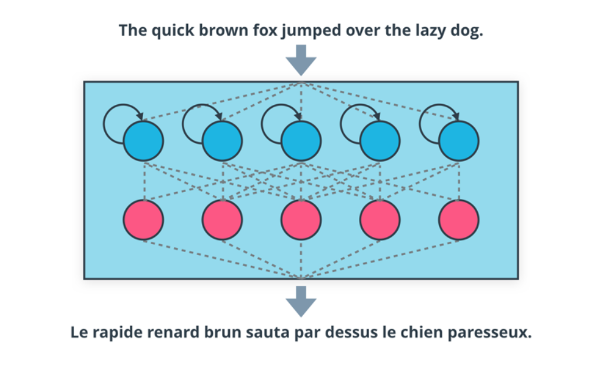

# **Project 2: Machine Translator**

          

There are about 6,500 languages spoken in the world. Machine translation is an automated translation from one language to another. Google Translate or Microsoft Translator are the examples of top performing machine translation services. Over the years of research, different methods were created for machine translation, such as [[rule-based](https://en.wikipedia.org/wiki/Rule-based_machine_translation)](https://en.wikipedia.org/wiki/Rule-based_machine_translation), [[statistical](https://en.wikipedia.org/wiki/Statistical_machine_translation)](https://en.wikipedia.org/wiki/Statistical_machine_translation), and [[example-based](https://en.wikipedia.org/wiki/Example-based_machine_translation)](https://en.wikipedia.org/wiki/Example-based_machine_translation) machine translation. Unlike these traditional approaches, Integration of deep learning in machine translation made more efficient and faster training possible using massive datasets. This led to higher accuracy and better performance. An end-to-end deep learning machine translation model was built for this project.   

# **Tasks**

The tasks for this project are outlined in the `machine_translation.ipynb` in three steps. Below are the steps taken.

## **Step 1 - Preprocess data**

*   Turn each sentence into a sequence of words ids and apply padding to handle unequal length of sentences in the corpus

## **Step 2 - Build DNNs **

*   Build deep neural networks that function as part of an end-to-end machine translation pipeline that accepts English text as input and return the French translation. The models are:
    *   Simple RNN
    *   RNN with Embedding
    *   Bidirectional RNN
    *   Encoder-Decoder RNN

## **Step 3 - Build a final model and obtain predictions**

*   Evaluate different neural network architectures and performances
*   Build and train the final model that incorporates embedding and a bidirectional RNN into one model:
    *   Bidirectional RNN with embedding + Encoder-Decoder RNN  
*   Obtain predictions on the final model and evaluate model performance

## **Below is the content of the README file included in the course.

# Introduction
In this notebook, you will build a deep neural network that functions as part of an end-to-end machine translation pipeline. Your completed pipeline will accept English text as input and return the French translation.

# Setup

This project requires GPU acceleration to run efficiently. Support is available to use either of the following two methods for accessing GPU-enabled cloud computing resources.

## Udacity Workspaces (Recommended)

Udacity Workspaces provide remote connection to GPU-enabled instances right from the classroom. Refer to the classroom lesson for this project to find an overview of navigating & using Jupyter notebook Workspaces.

## Amazon Web Services (Optional)

Please refer to the Udacity instructions for setting up a GPU instance for this project, and refer to the project instructions in the classroom for setup. The recommended AMI should include compatible versions of all required software and libraries to complete the project. [link for AIND students](https://classroom.udacity.com/nanodegrees/nd889/parts/16cf5df5-73f0-4afa-93a9-de5974257236/modules/53b2a19e-4e29-4ae7-aaf2-33d195dbdeba/lessons/2df3b94c-4f09-476a-8397-e8841b147f84/project)

## Install
- Python 3
- NumPy
- TensorFlow 1.x
- Keras 2.x

# Submission
When you are ready to submit your project, do the following steps:
1. Ensure you pass all points on the [rubric](https://review.udacity.com/#!/rubrics/1004/view).
2. Submit the following in a zip file:
  - `helper.py`
  - `machine_translation.ipynb`
  - `machine_translation.html`

## Converting to HTML

There are several ways to generate an HTML copy of the notebook:

 - Running the last cell of the notebook will export an HTML copy

 - Navigating to **File -> Download as -> HTML (.html)** within the notebook

 - Using `nbconvert` from the command line

    $ pip install nbconvert
    $ nbconvert machine_translation.ipynb
