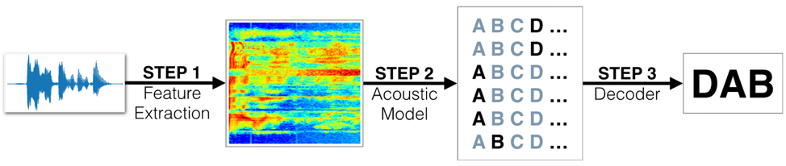

# **Project 3: DNN Speech Recognizer**

Speech recognition, also known as automatic speech recognition (ASR), has a wide range of applications including, but not limited to, speech to text service, chatbots for customer service, and voice assistants like Amazon’s Alexa. Unlike traditional phonetic-based models such as an HMM model, an end-to-end ASR model uses recurrent neural networks that works well for temporal dependency of speech. A deep neural network that functions as part of an end-to-end automatic speech recognition (ASR) pipeline was explored and built for this project.

# **Tasks**

The tasks for this project are outlined in the vui_notebook.ipynb in three steps. Below are the steps taken.

## **Step 1 - Extract features**

*   Investigate the [LibriSpeech dataset](http://www.openslr.org/12/) that will be used to train and evaluate the models
*   Convert raw audio to feature representations that are commonly used for ASR

## **Step 2 - Build acoustic Models**

*   Learn about the basic types of layers that are often used for deep learning-based approaches to ASR.
*   Build different neural networks that can map the extracted audio features to transcribed text. The models are:
    *   RNN + TimeDistributed Dense
    *   CNN + RNN + TimeDistributed Dense
    *   Deeper RNN + TimeDistributed Dense
    *   Bidirectional RNN + TimeDistributed Dense

## **Step 3 - Build a final model and obtain predictions**

*   Evaluate different neural network architectures and performances
*   Build and train the final model:
    *   CNN + Bidirectional RNNs + TimeDistributed Dense
*   Describe the final model architecture and decision behind it
*   Obtain predictions on the final model
*   Evaluate the transcription accuracy and think of ways to improve model performance

### Description of the final DNN speech recognition model

The evaluation of different models revealed that a combination of the CNN and RNN model performed better than other sample models. To develop a final model architecture, I first tried to add bid-directional and recurrent layers separately to the CNN + RNN + TimeDistributed Dense model in an attempt to improve its performance. However, the results were about the same or slightly worse than the original model. After testing multiple model architectures, I decided to include all of them--bi-directional, CNN, RNN, and Dense layers --in the model. It clearly improved the model performance. I trained these models with and without dropouts to address the overfitting issues. In general, the results were slightly better when dropouts were not included in the model but I kept them in the final model to address the overfitting issues.

The final model I built is a combination of the bi-directional, CNN, and RNN models with three recurrent layers. The model architecture is as follows:

1. Acoustic input was passed through the 1D Convolutional Layer.
2. Batch normalization was applied to the CNN output which was fed into the RNN layer as an input.
3. RNN layer was added in a loop.
4. Batch normalization was applied again for each RNN layer.
5. Dropout layer was added.
6. TimeDistributed Dense layer was applied after each dropout layer.
7. Softmax activation was added as a last layer.

The training and validation loss suggested that the final model outperformed the sample models (model 0 to model 4). To increase the transcription accuracy further, a larger amount of training data is required for the model to learn more effectively. For speed purposes, a small amount of training data was provided in this course so the input data was inadequate in size to achieve high accuracy. Adding more data can also help address the issue of model overfitting, as shown in the increase in the validation loss.
